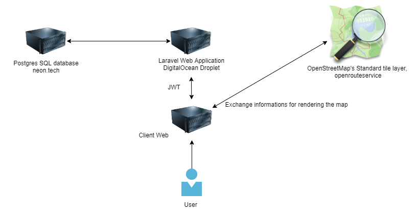

# Description du projet

Beaucoup d'entre nous ont déjà vécu des covoiturages où la musique ne correspondait pas du tout à nos goûts personnels,
créant une ambiance inconfortable tout au long du trajet, et ne donnant pas envie de renouveller l'expérience.

Le projet "CoWebTurage" réinvente le covoiturage en proposant une expérience unique.
En mettant l'accent sur la musique, les voyageurs peuvent choisir des compagnons de trajet qui partagent leurs
préférences musicales, créant une ambiance agréable en route.
Cette plateforme moderne facilite la recherche et la réservation de trajets, que ce soit pour les déplacements
quotidiens ou les escapades occasionnelles.

Une des caractéristiques distinctives de CoWebTurage est son approche orientée vers la communauté.
Les utilisateurs peuvent laisser des commentaires et des évaluations après chaque trajet, aidant ainsi les autres à
faire des choix informés.

## Besoins Fonctionnels

- Pouvoir créer un compte utilisateur en indiquant leur e-mail et mot de passe.
- Pouvoir se connecter à un compte existant.
- Les utilisateurs doivent pouvoir ajouter des détails à leur profil, tels que leurs préférences musicales, nom, prénom,
  date de naissance, ...
- L'utilisateur doit pouvoir renseigner les informations sur le véhicule (nombre de places, modèle, ...) et les
  modifier.
- L'utilisateur qui souhaite utiliser sa voiture pour le covoiturage doit pouvoir indiquer ses horaires, lieu de
  départ, dates et nombre de places disponibles
- L'utilisateur doit pouvoir afficher une liste des covoiturages disponibles dans un lieu, pour une destination à une
  date précise et nombre de places disponibles grâce à des filtres
- L'utilisateur doit pouvoir réserver un ou plusieurs trajets.
- Les listes de covoiturage disponibles doivent indiquer l'heure de départ, si un retour est possible et si il y a des
  détours
- L'utilisateur qui gère le covoiturage doit pouvoir accepter ou refuser des utilisateurs.
- Après avoir effectué le trajet, l'utilisateur doit pouvoir donner un feedback.
- L'utilisateur peut choisir un partenaire de covoiturage selon ses style musicaux préfèrés.
- L'utilisateur doit pouvoir communiquer avec les autres utilisateurs par le biais de messages.
- L'utilisateur doit pouvoir ajouter et modifier ses moyens de paiements.

## Besoins Non-Fonctionels

- Le système doit supporter des créations de comptes et recherches d'utilisateurs sans délai notable.
- Le site web doit pouvoir supporter un incrément significatif d'utilisateurs à un moment donné
- Backups réguliers des données des utilisateurs.
- L'interface utilisateur doit être simple à comprendre et utiliser.
- Le site web doit être compatible avec tous les browsers principaux (Chrome, Firefox, ...)
- Offrir la possibilité de changer la langue de français à anglais et vice-versa

## Architecture

Voici le schéma de l'architecture choisie:

## Methodologie

Pour ce projet, nous avons décidé d'utiliser la méthode SCRUM. Cette méthode est adaptée à la taille du projet et nous
permettra de livrer des versions intermédiaires du projet. Nous allons donc découper le travail en Sprint, faire des
daily meeting afin de synchroniser l'équipe au maximum.

Nous allons également utiliser un Kanban qui sera directement accessible dans l'onglet project de notre repository
Github.

## Choix technique

Nous avons choisi de réaliser notre application en laravel 10 PHP 8.3
La raison de ce choix est la facilité de création d'un site web et d'un système d'authentification.
Pour la partie frontend, nous avons décidé d'utiliser livewire et blade, pour rester dans la stack laravel et PHP,
évitant au maximum de complexifier le front.

## Processus de travail

Pour notre projet, nous avons décidé de garder un processus le plus simple possible.
Nous avons mis en place une version simplifiée de gitflow, c'est à dire une architecture feature branch et main. La
mise en place d'une éventuelle branche develop n'a pas été jugée nécessaire, car nous n'avons pas de host pour mettre en
place une éventuelle preprod.

Pour garantir une application toujours fonctionelle, nous avons mis en place des tests automatiques, via Github
Action, ainsi que de forcer la review de code par un pair. Pour simplifier nos opérations, nous avons mis aussi en place
un déploiement automatique sur le serveur de production via GitHub Action.

## Liens CoWebTurage

- GitHub project: https://github.com/orgs/CoWebTurage/projects/2
- GitHub repositories: https://github.com/CoWebTurage/CoWebTurage
- Website production: http://146.190.177.74
- Landing page: http://146.190.177.74/landing_page
